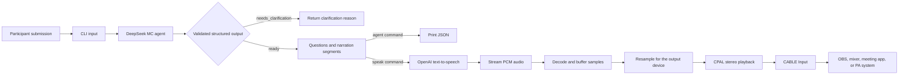

# SVMIC


> **Turn messy audience questions into clear, broadcast-ready MC narration.**

SVMIC is a Windows command-line tool for live Q&A workflows. It takes a
participant's written submission, identifies the questions inside it, rewrites
them into natural spoken language, and can read the result aloud through a
virtual microphone.

The goal is simple: an MC or event operator should be able to move from
**unstructured audience input** to **clear, consistent on-air narration**
without manually editing every question or recording audio files in advance.

## Why SVMIC?

Audience questions are rarely ready to be read aloud. A single submission may
contain background context, multiple questions, informal wording, or a mix of
languages. Reading that text verbatim can make a live session difficult to
follow and can make the quality of the event depend on how quickly an operator
can edit under pressure.

SVMIC addresses that workflow by:

- separating multiple questions from one submission;
- preserving the original wording as an exact source excerpt;
- rewriting each question for clear spoken delivery;
- summarizing what the participant is trying to find out, without answering it;
- producing narration in the participant's dominant language, or a requested
  language;
- streaming generated speech directly to a virtual audio cable.

SVMIC is an interpretation and delivery tool. It does **not** answer
participant questions or invent factual claims.

## How it works



### The product flow

1. The operator supplies a question as a command-line argument or through
   standard input.
2. The DeepSeek agent treats the submission as quoted participant data. It
   extracts each distinct question and prepares an MC-friendly version.
3. SVMIC validates the response before using it. Question numbers, source
   excerpts, narration segments, and character limits must all be consistent.
4. With `agent`, the validated result is returned as JSON for review or for
   another system to consume.
5. With `speak`, each narration segment is sent to OpenAI TTS as it is needed.
6. The returned PCM audio is decoded, buffered, resampled when necessary, and
   played to `CABLE Input` through CPAL.
7. Any application listening to the other side of the VB-Audio Virtual Cable
   can use the generated voice as an audio input.

## Commands

SVMIC has two commands:

| Command | Use it when |
| --- | --- |
| `agent` | You need structured output for moderation, review, automation, or debugging. |
| `speak` | You want the narration to be generated and sent to the virtual microphone. |

Both commands accept a direct text argument or `-` to read the submission from
stdin. The optional `--language` flag overrides the language used for the
generated narrative.

## Technology

SVMIC is a small Rust application with a focused streaming pipeline:

- **Rust 2024** provides the native CLI and audio runtime.
- **Tokio** handles asynchronous API calls, timeouts, retries, and streaming.
- **DeepSeek Responses API** with `deepseek-flash` interprets participant
  submissions and creates validated MC narration data.
- **OpenAI Audio Speech API** with `gpt-4o-mini-tts` and the `marin` voice
  generates the spoken output.
- **Hyper and hyper-rustls** provide HTTPS clients using native TLS roots.
- **Serde and serde_json** model and validate the structured agent response.
- **CPAL** connects the application to the Windows audio output device.
- **ringbuf** provides the producer-consumer audio buffer used during playback.
- **VB-Audio Virtual Cable** exposes the generated narration to other audio
  applications.

The TTS stream is consumed as 16-bit PCM audio at a 24 kHz source rate.
SVMIC adapts that stream to a supported stereo configuration on the selected
virtual cable, starts playback after a short prebuffer, and inserts silence if
the stream temporarily underflows.

## Requirements

- Windows
- Rust with support for **edition 2024**
- [VB-Audio Virtual Cable](https://vb-audio.com/Cable/) installed
- A `CABLE Input` playback device visible to Windows
- A DeepSeek API key
- An OpenAI API key for the `speak` command
- An application such as OBS, a mixer, or a meeting tool that can select the
  virtual cable as an audio input

## Setup

Clone the repository and build the release binary:

```powershell
git clone https://github.com/Adedev-W/svmic.git
cd svmic
cargo build --release
```

Create a `.env` file in the project root:

```dotenv
DEEPSEEK_API_KEY=your_deepseek_api_key
OPENAI_API_KEY=your_openai_api_key
```

SVMIC loads this file automatically. Keep it out of version control and never
share the API keys.

Before using `speak`, verify that Windows exposes the virtual cable as
`CABLE Input` or `CABLE Input (VB-Audio Virtual Cable)`. The application sends
audio to `CABLE Input`; an application receiving that signal normally selects
the corresponding `CABLE Output` device.

## Usage

### Inspect the structured interpretation

Pass a submission as one quoted argument:

```powershell
.\target\release\svmic.exe agent "What is the product strategy, and how will success be measured?"
```

The command writes the JSON result to stdout. Operational logs are written to
stderr, so the JSON can be piped into another tool:

```powershell
.\target\release\svmic.exe agent "How does the roadmap support our customers?" |
  Out-File .\agent-output.json
```

Use stdin for a longer submission:

```powershell
Get-Content .\question.txt -Raw |
  .\target\release\svmic.exe agent -
```

Request a specific output language:

```powershell
.\target\release\svmic.exe agent `
  --language "English" `
  "Can you explain the launch plan?"
```

### Send narration to the virtual microphone

```powershell
.\target\release\svmic.exe speak `
  "What is the main product goal for the next quarter?"
```

After the command starts, select **CABLE Output (VB-Audio Virtual Cable)** as
the input device in OBS, your mixer, meeting application, or other destination.

The application also prints a disclosure reminder before synthesis: listeners
should be told that the voice is AI-generated and not a human voice.

## Output behavior

When the agent can identify one or more meaningful questions, it returns
`status: "ready"` with:

- the detected source and output languages;
- a context summary;
- an ordered list of questions;
- the original `source_text` for each question;
- a `spoken_question` suitable for an MC;
- a `simplified_intent` describing what the participant wants to learn;
- one or more ordered TTS segments.

When the submission does not contain a meaningful question, it returns
`status: "needs_clarification"` and a `clarification_reason`. The `speak`
command stops before calling TTS, so unclear input is never turned into
accidental narration.

The agent enforces the following guarantees before output is accepted:

- question numbers are contiguous and match `question_count`;
- each source excerpt occurs in the participant submission;
- every question is covered by exactly one TTS segment;
- TTS segments are non-empty and no longer than 3,500 Unicode characters;
- clarification output contains no questions or TTS segments.

## Reliability and failure handling

Network requests have bounded timeouts and a single retry for transient
failures such as rate limits, server errors, and connection timeouts. Errors are
reported explicitly rather than converted into an apparently successful
result.

Audio playback uses a bounded ring buffer and waits for a short prebuffer
before starting. If the device cannot keep up, SVMIC inserts silence and
reports the number of underflow frames. It also verifies that the selected
virtual cable supports a stereo 16-bit output configuration.

## Development

Run the Rust test suite:

```powershell
cargo test
```

Build the optimized binary:

```powershell
cargo build --release
```

The legacy WAV playback implementation in `src/audio_legacy.rs` is retained as
historical code; the active application path is the streaming pipeline used by
`src/audio.rs`, `src/tts.rs`, and `src/agent.rs`.

## License

SVMIC is available under the [MIT License](./LICENSE).
