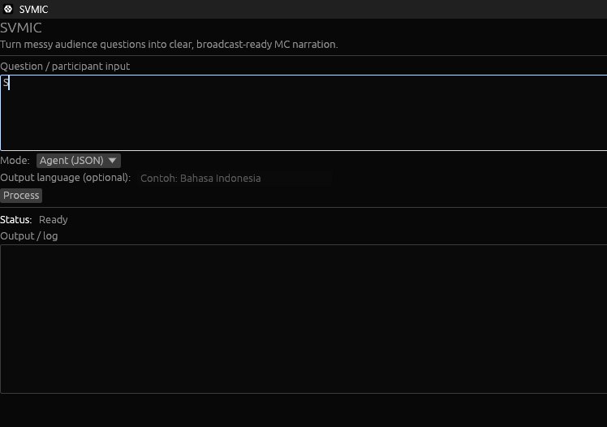
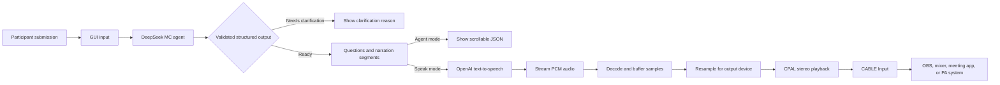

# SVMIC


> **Turn messy audience questions into clear, broadcast-ready MC narration.**

SVMIC helps event operators transform unstructured participant submissions into
questions an MC can read with confidence. It identifies the real questions,
preserves the participant's meaning, rewrites each question for natural spoken
delivery, and can send the finished narration directly to a virtual microphone.

Built for live Q&A, SVMIC keeps the operator in control: review structured
output in the app, choose the desired delivery mode, and process each
submission without switching between tools.

## The problem SVMIC solves

Audience submissions rarely arrive ready for the stage. One message may contain
context, multiple questions, informal wording, or several languages. Reading it
verbatim can slow down a live session and make the quality of delivery depend
on manual editing under pressure.

SVMIC turns that raw input into a consistent on-air workflow:

- separate multiple questions from a single participant submission;
- preserve the original wording as a source excerpt;
- rewrite questions into clear, MC-friendly narration;
- summarize the participant's intent without answering the question;
- generate narration in the detected language or a requested language;
- stream the narration to a virtual audio cable when it is ready.

SVMIC is an interpretation and delivery tool. It does **not** answer
participant questions or invent factual claims.

## Product experience

The native Windows app is designed for fast operation during a live session:



1. Paste or type a participant submission into the multiline input box.
2. Optionally specify the output language.
3. Choose how the result should be delivered.
4. Press **Process**.
5. Review the structured result or let SVMIC narrate it through the virtual
   microphone.

Both the input and output areas support scrolling, making long submissions and
structured responses practical to review. Network and audio work run in the
background so the interface remains responsive while a request is processing.
Status messages and failures are shown directly in the app.

## Modes

### Agent (JSON)

Use **Agent (JSON)** when you want to inspect the interpretation before it goes
on air. SVMIC displays validated structured output containing:

- detected source and output languages;
- a concise context summary;
- the number and order of detected questions;
- the original source excerpt for each question;
- an MC-ready `spoken_question`;
- a `simplified_intent` describing what the participant wants to learn;
- ordered text-to-speech segments.

This mode is useful for moderation, review, production checks, and workflows
that need a predictable structured result.

### Speak (CABLE Input)

Use **Speak (CABLE Input)** when the result is ready for live delivery. SVMIC
sends each narration segment to OpenAI text-to-speech, decodes the returned PCM
stream, and plays it through the Windows device exposed as `CABLE Input`.

Select **CABLE Output (VB-Audio Virtual Cable)** as the input device in OBS,
your mixer, meeting application, or other destination that should receive the
generated voice.

Listeners should be told that the voice is AI-generated and not a human voice.

## How it works



The DeepSeek agent treats the submission as participant data, extracts each
distinct question, and prepares an MC-friendly version. Before the result is
used, SVMIC validates question numbering, source excerpts, narration coverage,
and segment limits.

For speech delivery, the OpenAI TTS stream is consumed as 16-bit PCM audio at a
24 kHz source rate. SVMIC adapts it to a supported stereo configuration on the
selected virtual cable, starts playback after a short prebuffer, and inserts
silence if the stream temporarily underflows.

## Output guarantees

When meaningful questions are found, the result has `status: "ready"` and
contains the validated questions and narration segments.

When the submission does not contain a meaningful question, the result has
`status: "needs_clarification"` and a `clarification_reason`. Speak mode stops
before calling TTS, so unclear input is never turned into accidental narration.

Before output is accepted, SVMIC verifies that:

- question numbers are contiguous and match `question_count`;
- every source excerpt occurs in the participant submission;
- every question is covered by exactly one TTS segment;
- TTS segments are non-empty and no longer than 3,500 Unicode characters;
- clarification output contains no questions or TTS segments.

## Requirements

- Windows
- Rust with support for **edition 2024**
- [VB-Audio Virtual Cable](https://vb-audio.com/Cable/) for Speak mode
- A playback device named `CABLE Input` or
  `CABLE Input (VB-Audio Virtual Cable)`
- A DeepSeek API key
- An OpenAI API key for Speak mode
- OBS, a mixer, a meeting application, or another destination that can select
  the virtual cable as an audio input

## Setup

Clone the repository and build the application:

```powershell
git clone https://github.com/Adedev-W/svmic.git
cd svmic
cargo build --release
```

Create a `.env` file in the project root:

```dotenv
DEEPSEEK_API_KEY=your_deepseek_api_key
OPENAI_API_KEY=your_openai_api_key
```

SVMIC loads these values automatically. Keep the file out of version control
and never share the API keys.

Before using Speak mode, confirm that Windows exposes the virtual cable as
`CABLE Input` or `CABLE Input (VB-Audio Virtual Cable)`. The application sends
audio to `CABLE Input`; receiving applications normally select the matching
`CABLE Output` device.

## Usage

Start the native GUI:

```powershell
cargo run --release
```

In the SVMIC window:

1. Enter the participant's text in **Question / participant input**.
2. Enter an output language if needed, such as `Bahasa Indonesia`.
3. Select **Agent (JSON)** or **Speak (CABLE Input)**.
4. Press **Process**.
5. Follow the status indicator and review the scrollable output area.

The language field accepts letters, spaces, and hyphens, with a maximum of 64
characters. Leave it empty to let the agent determine the output language from
the submission.

## Reliability and failure handling

SVMIC uses bounded timeouts and a retry for transient network failures such as
rate limits, server errors, and connection timeouts. Errors are reported
explicitly rather than converted into an apparently successful result.

Audio playback uses a bounded ring buffer and waits for a short prebuffer before
starting. If the device cannot keep up, SVMIC inserts silence and reports the
number of underflow frames. It also verifies that the selected virtual cable
supports a stereo 16-bit output configuration.

## Technology

SVMIC combines a focused native UI with a streaming interpretation and audio
pipeline:

- **Rust 2024** for the application and runtime;
- **eframe/egui** for the native window and scrollable text controls;
- **Tokio** for asynchronous API calls, timeouts, retries, and background work;
- **DeepSeek Responses API** with `deepseek-flash` for question interpretation;
- **OpenAI Audio Speech API** with `gpt-4o-mini-tts` and the `marin` voice;
- **Hyper and hyper-rustls** for HTTPS clients with native TLS roots;
- **Serde and serde_json** for structured output and validation;
- **CPAL** for Windows audio device playback;
- **ringbuf** for the producer-consumer audio buffer;
- **VB-Audio Virtual Cable** for routing generated narration to other apps.

## License

SVMIC is available under the [MIT License](./LICENSE).
